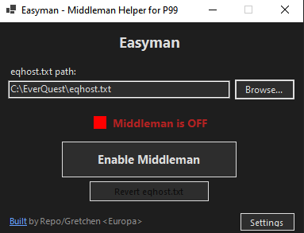
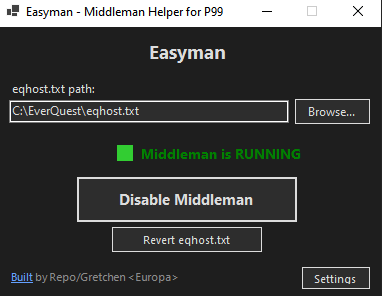
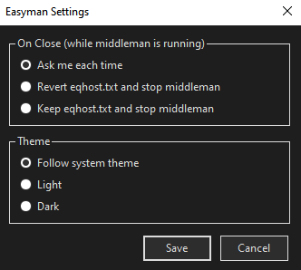

# Easyman

[](https://github.com/sadsfae/easyman/releases/latest)
[](https://github.com/sadsfae/easyman/actions/workflows/build-release.yml)
[](https://github.com/sadsfae/easyman/actions/workflows/lint.yml)

A simple Windows GUI wrapper for [p99-login-middlemand](https://github.com/rm-you/p99-login-middlemand), making it easy for Project 1999 players to enable and disable the login middleman proxy without manual file editing.

**First Launch**  Browse your EQ directory for `eqhost.txt` and click `Enable Middleman`



**Enabled and Running** Now minimize and launch P99 Everquest



**Application Settings**



## Credits

Easyman is a GUI wrapper for **middlemand**, a login proxy for EverQuest that relays connections between your client and the EQEmulator login server.

- **middlemand** originally written by [@Zaela](https://github.com/Zaela) -- [p99-login-middlemand](https://github.com/Zaela/p99-login-middlemand)
- **Windows port** by [@rm-you](https://github.com/rm-you) -- [p99-login-middlemand](https://github.com/rm-you/p99-login-middlemand)

## Download

Grab the latest `Easyman-vX.X.X.zip` from the [Releases](../../releases) page. Extract the zip -- it contains both `Easyman.exe` and `middleman.exe`.

## Usage

1. Extract the zip to any folder. Both `Easyman.exe` and `middleman.exe` must be in the same folder.
2. Run `Easyman.exe`.
3. Click **Browse** and locate your `eqhost.txt` file in your EverQuest installation directory. This is a one-time step -- Easyman remembers the path.
4. Click **Enable Middleman** to start the proxy.
5. Launch EverQuest and log in normally.
6. **Keep Easyman open** while you play. It manages the middleman proxy in the background. You can minimize it to the taskbar.
7. When you are done playing, click **Disable Middleman** or close Easyman -- it will offer to clean up automatically.

## How it works

When you click **Enable Middleman**, Easyman:

- Updates your `eqhost.txt` to route login traffic through `localhost:5998`
- Starts the bundled `middleman.exe` proxy in the background
- Shows a green status indicator

When you click **Disable Middleman**, Easyman:

- Restores your `eqhost.txt` to point at `login.eqemulator.net:5998`
- Stops the middleman process
- Shows a red status indicator

If you close Easyman while middleman is still running, it will ask whether to disable it first or leave it running.

Easyman also detects if a `middleman.exe` process is already running when it starts, and offers to take it over so you never end up with duplicate processes.

## Allowing Additional EMU Servers

By default, middleman filters the server list to only show Project 1999 servers (Blue, Green, Red). You can whitelist additional EQEmu servers so they are not filtered out.

**Via the GUI:** Open **Settings** and use the **Allowed EMU Servers** section to add, remove, or revert entries. Changes are saved to `allowed_emu.txt` alongside the executable.

**Via the config file:** Edit `allowed_emu.txt` in the same folder as `Easyman.exe`. Add one server name per line. Matching is case-insensitive and uses partial/substring matching, so `Ryhoz` would match a server named `Ryhoz world`. Lines starting with `#` or `;` are treated as comments.

Example `allowed_emu.txt`:

```ini
# Allowed EMU server names (case-insensitive substring match)
# Servers whose name starts with "Project 1999" are always allowed.
Ryhoz world
```

If `allowed_emu.txt` is missing, only Project 1999 servers are shown (the original behavior). Middleman reads this file on startup, so restart it after making manual edits.

## Windows SmartScreen

On first run, Windows may show a "Windows protected your PC" warning because the application is new and not yet widely recognized. This is normal for any newly released application.

To proceed:

1. Click **More info**
2. Click **Run anyway**

## Building from source

Requires the [.NET 8 SDK](https://dotnet.microsoft.com/download/dotnet/8.0).

```bash
dotnet publish Easyman/Easyman.csproj -c Release -r win-x64 --self-contained -p:PublishSingleFile=true -o ./publish
```

On Linux, add `-p:EnableWindowsTargeting=true` to cross-compile for Windows.

## License

[Open Source](LICENSE.md) (GPLv3). See [Zaela/p99-login-middlemand](https://github.com/Zaela/p99-login-middlemand) for upstream licensing.

Built with :heart: by Repo/Gretchen \<Europa\>
